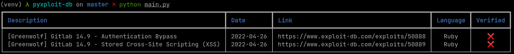

# Pyxploit-db

An exploit-db.com python API using advanced search with all possible filters.

## Future use

```python
>>> import pyxploitdb
>>> result = pyxploitdb.searchEDB("Gitlab 14.9", platform="ruby", _print=False)
>>> print(result)
[['50888', 'Gitlab 14.9 - Authentication Bypass', 'webapps', 'Ruby', '2022-04-26', 0, 0, [],
'Greenwolf', 'https://www.exploit-db.com/exploits/50888'], 
['50889', 'GitLab 14.9 - Stored Cross-Site Scripting (XSS)', 'webapps', 'Ruby',
'2022-04-26', 0, 0, [], 'Greenwolf', 'https://www.exploit-db.com/exploits/50889']]
```
### With _print=True



## TODO (WIP)

- [x] searchEDB function
  - [ ] Return a dictionnary rather than an array for readability purposes
- [ ] searchCVE function
- [ ] Create a package